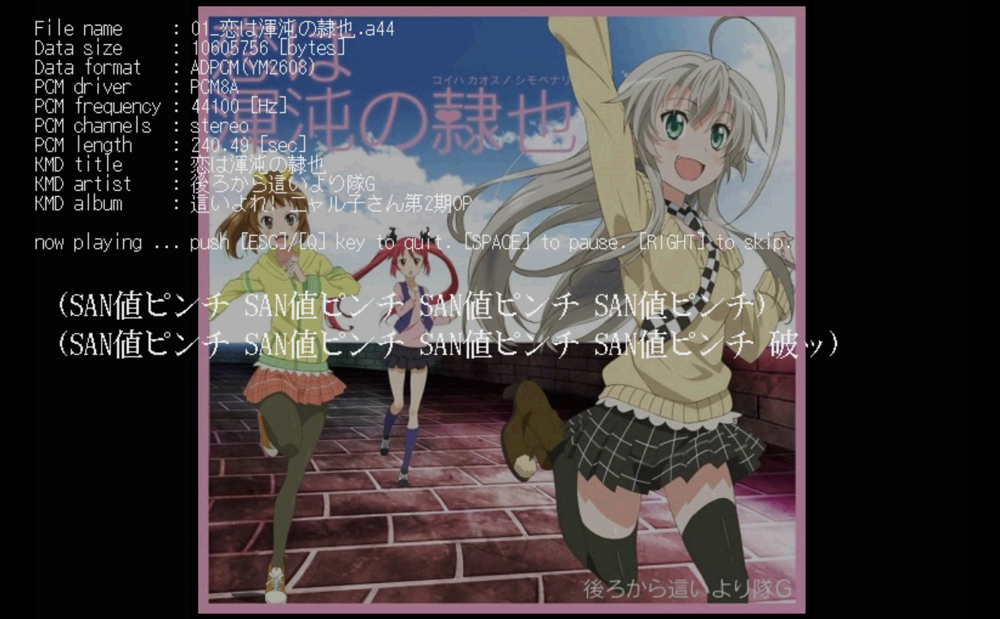
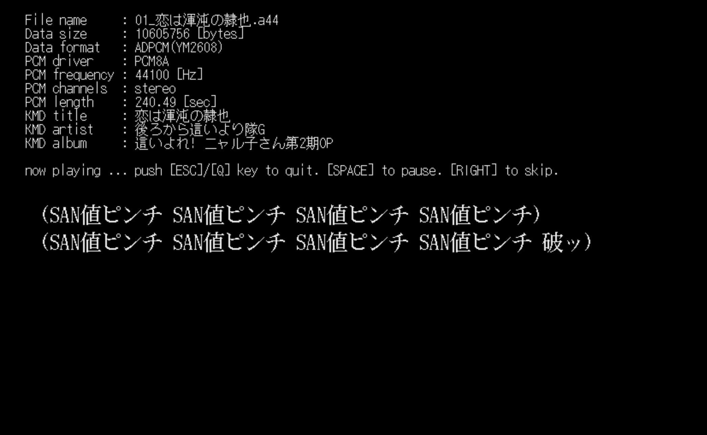
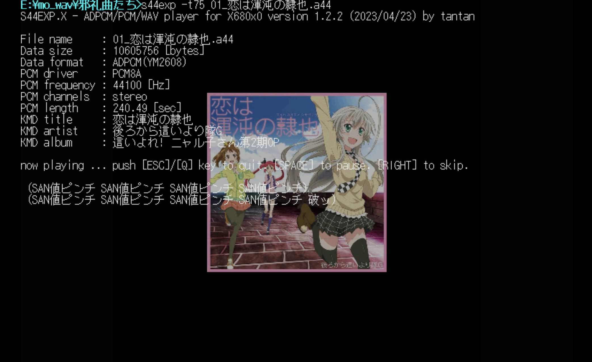
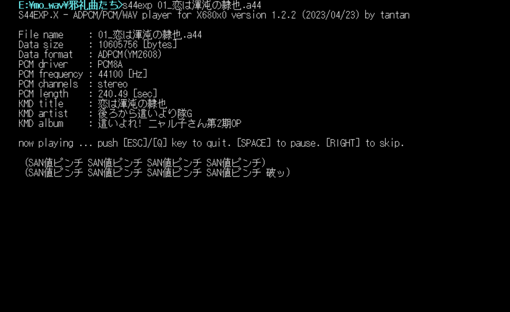

# S44EXP.X
S44/A44/WAV/PCM player for X680x0/Human68k

以下の形式のファイルを再生するプレーヤーです。ファイルの種別は拡張子で判断します。

 - X68k(MSM6258V) ADPCM 15.6kHz mono (.PCM)
 - 16bit符号付き big endian raw PCM (.S32/.S44/.S48/.M32/.M44/.M48)
 - 16bit符号付き WAV (.WAV)
 - 4bit符号付き YM2608 ADPCM (.A32/.A44/.A48/.N32/.N44/.N48)

以下のような特徴があります。

- KMD歌詞データの表示に対応しています。
- KMD歌詞データエディタKMDEDのKMD埋め込みタグ情報・アルバムアート表示に対応しています。
- インダイレクトファイルによるプレイリスト再生に対応しています。

出力デバイスはX68k内蔵ADPCMまたはMercury-Unitになります。組み込むPCM8ドライバによって決まります。

- [PCM8A.X](http://retropc.net/x68000/software/sound/adpcm/pcm8a/) ... すべての形式がリアルタイムに内蔵ADPCMの音声に変換されて出力されます。
- [PCM8PP.X](http://retropc.net/x68000/software/hardware/mercury/pcm8pp/) ... 内蔵ADPCM形式も含めたすべての形式の音声がMercury-Unitから出力されます。

注意：PCM8A.X / PCM8PP.X のいずれも組み込まない場合は S44EXP.X 自身による内蔵ADPCM再生となりますが、歌詞データ表示での遅れが目立つ場合がありますので、いずれかの組み込みを推奨します。

注意：PCM8PP.X を使って SCSIディスク上のファイルを Mercurty-Unit から再生させる場合は、[HSCSI.X](http://retropc.net/x68000/software/disk/scsi/hscsi/) の導入を強く推奨します。導入していない場合はプチノイズが発生する場合があります。

注意：PCM8PP.X はデフォルトで再生周波数44.1kHzとなります。S48/M48などの48kHzのPCMデータを再生するためにはPCM8PPのコマンドラインオプションで48kHzの再生周波数を指定する必要があります。

注意：本プログラムは元となった MP3EXP.X で対応していた MP3 の再生には対応していません。コンバータ [MP3CONV.X](https://github.com/tantanGH/mp3conv) を使って事前にコンバートしてください。

---

### インストール方法

S4EXPxxx.ZIP をダウンロードして展開し、S44EXP.X をパスの通ったディレクトリに置きます。

---

### 使用方法

- 内蔵ADPCMで鳴らす場合

pcm8a.x を常駐させて、

    s44exp <PCMファイル名>

- Mercury-UNITで鳴らす場合

pcm8pp.x を常駐させて、

    s44exp <PCMファイル名>

- KMD歌詞表示を行う場合

pcm8a.x または pcm8pp.x を常駐させて、
全画面、アートワーク輝度70% なら

    s44exp -x -t70 <PCMファイル名>

---

### コマンドラインオプション

引数をつけずに実行するか、`-h` オプションをつけて実行するとヘルプメッセージが表示されます。

    usage: s44exp [options] <input-file[.pcm|.sXX|.mXX|.aXX|.nXX|.wav]>
    options:
         -v[n] ... volume (1-15, default:7)
         -l[n] ... loop count (none:infinite, default:1)
         -t[n] ... album art display brightness (1-100, default:off)
         -x    ... full screen

         -i <indirect-file> ... playlist indirect file
         -s    ... shuffle play

         -b<n> ... buffer size [x 64KB] (2-96,default:4)
         -h    ... show help message

`-v` オプションでPCM8A.X/PCM8PP.X使用時の音量を指定します。デフォルトは7です。PCM8A/PCM8PP標準は8ですが、音割れを防ぐために7としています。

`-l` オプションでループ回数を指定します。数字を省略した場合は無限ループになります。

`-t` オプションでアルバムアート表示の明るさを指定します。オプションなしまたは0の場合は表示しません。アルバムアートはjpeg/bmpのみ対応しています。デフォルトでは1/2サイズに縮小されて表示されます。

`-x` オプションで拡大表示モードとなります。KMD歌詞データを24ドットフォントで表示します。また、アルバムアートをオリジナルの大きさで表示します。512x512を超える部分はカットされます。この時にファンクションキー表示行も消します。

`-i` インダイレクトファイルを指定します。詳細は後述。

`-s` インダイレクトファイルで複数のPCMファイルを指定した場合、もしくはコマンドラインで複数のPCMファイルを指定した場合にシャッフル再生を行います。

`-b` オプションでリンクアレイチェーンのバッファ数を指定します。1バッファが約64KBです。デフォルトは4です。再生が追いつかずにバッファアンダーランのエラーで途中終了してしまうような場合は大きくしてみてください。

---

### インダイレクトファイル

インダイレクトファイルは、1行に1ファイル名を記述したテキストファイルです。長いコマンドラインで複数のPCMファイル名を与える代わりに利用できます。

    G:\S44\HOGE1.S44
    G:\S44\HOGE2.S44

さらにファイル名に続けてボリューム値も指定可能です。これはコマンドラインで与える `-v<n>` と同じ意味になりますが、インダイレクトファイルの場合は曲ごとに細かく指定することができます。

    H:\A44\FUGA1.A44,v8
    H:\A44\FUGA2.A44,v7

なお、あまり大きいボリューム値を指定するとオーバーフローして音割れの原因になりますので気をつけてください。

インダイレクトファイルを使ったプレイリスト再生を行うには`-i`オプションを使います。

    s44exp -x -t70 -i <インダイレクトファイル名>

`-s` をつけるとシャッフルモードになります。

    s44exp -x -t70 -i <インダイレクトファイル名> -s

また、インダイレクトファイルやコマンドラインから複数のファイルを指定している場合は、カーソルキーの RIGHT で次の曲に移動できます。

さらにカーソルキーの LEFT で前の曲、カーソルキーの UP で今の曲の頭に移動します。

---

### KMD歌詞データ再生

Mercury-Unit デファクトスタンダードの録音再生ツール、Yas氏のSMR.XのKMD歌詞データファイルの簡易表示に対応しています。`-x`オプションと`-t<n>`オプションを組み合わせてコントロールできます。以下の例を参考にしてください。

PCMファイルと同じディレクトリに同じ主ファイル名でKMDファイルを置いた状態で、

- `-x` `-t<n>` を同時に指定 ... 全画面・アートワークフルサイズ

- `-x` のみ指定 ... 全画面・アートワークなし

- `-t<n>` のみ指定 ... 歌詞簡易表示・アートワークハーフサイズ

- `-x` `-t<n>` いずれも指定なし ... 歌詞簡易表示のみ

KMDは表示上のタイミングの微妙なずれなどがあり得るため、KMDデータを新規に作成する際にはできるだけ本家SMR.Xで表示を確認するようにしてください。

拙作ステップ入力式KMD歌詞エディタ[KMDED.X](https://github.com/tantanGH/kmded)を利用すると比較的簡単にKMDデータを作成することが可能です。

---

### History

* 1.2.6 (2023/07/31) ... S44SEL.Xからの呼び出しに対応
* 1.2.5 (2023/06/25) ... コマンドラインパース時の不具合修正
* 1.2.4 (2023/06/12) ... YM2608変換テーブルをハイメモリが使える場合はそちらに取るようにした
* 1.2.3 (2023/04/29) ... カーソルキー左と上の操作に対応した
* 1.2.2 (2023/04/23) ... 000機でアドレスエラーが出ていたのを修正
* 1.2.1 (2023/04/22) ... シャッフルモードに対応した
* 1.2.0 (2023/04/22) ... インダイレクトファイルに対応した
* 1.1.2 (2023/04/14) ... PCM8PP.X のバージョンチェックを少し緩和
* 1.1.1 (2023/04/11) ... PCM8A.X 無しだと X68000Z EAK 1.1.3 で正常に再生できない症状への対策を行なった
* 1.1.0 (2023/04/01) ... 初版

---

